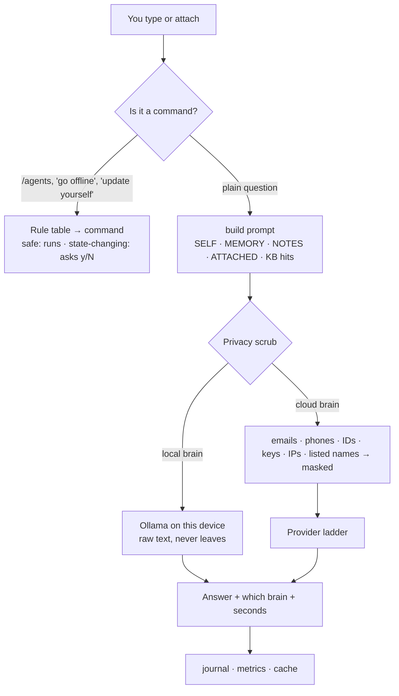
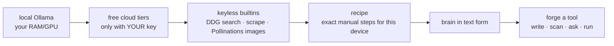
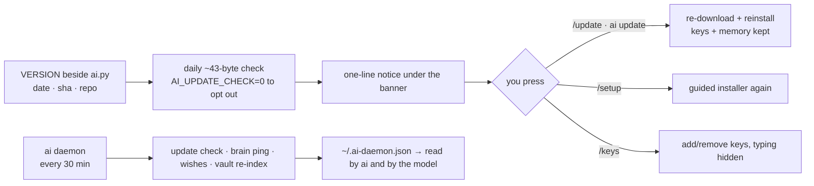

# How Aasmaan works — the whole system on one page

Everything below lives in one file, `ai.py`. The diagrams are the map; the file is the territory. Grep the names in **bold** to find each piece.

## 1. One message, start to finish

- **`chat_command`** and **`self_intent`**: fixed regex tables. The model never decides to run a command.
- **`build`**: assembles the prompt. The `SELF` block tells the model its own version, files and limits every turn, so "what version are you?" is answered from fact.
- **`redact`**: the privacy scrub, applied only to text bound for a cloud provider.
- **`route`**: tries brains in order, records failures (a rate-limit is not a death), and refuses to send images to a brain that cannot see.

## 2. The provider ladder — "no" is never the last answer

- **Connectors:** `connectors.json` (vetted, data only) → **`mcp_find`** / **`connector_intent`** (keyword buckets, offline) / **`mcp_add_catalogue`** (template tokens filled once, HOME refused as a root) / **`mcp_forge`** (brain fills one function in a fixed stdio-MCP skeleton, `_risky` scan, preview, register only if clean); **`lists_cmd`** for the family bucket.
- **Tuning:** **`TUNING`** holds per-tier numbers (**`model_tier`** / **`tier_now`** / **`knob`**), applied in `agent_persona`, `expert_kb`, `ask` (answer cap), `brain_order` (demotion) and `classify` (thresholds); `~/.ai-tuning.json` may change numbers only. **`usage_note`** records real token counts per brain; **`plan_cmd`** is the orchestrator (deterministic doors first, then a strict JSON plan the brain must fit).
- **Discovery:** **`ollama_models`** reads Ollama's tags and **`models_autoattach`** fills unset chat/vision/embed roles at start; **`custom_provider`** turns `AI_OAI_URL` into a brain (loopback = local); MCP servers from `~/.ai-tools.json` are `/do` providers (**`mcp_run`**, attended only, text as JSON).
- **`PROVIDERS`** is the brain order; **`brain_order`** re-sorts it by what is alive and what the question needs.
- **Rung 0 — hands.** If the capability is a device hand on this platform (**`HANDS`**, **`hand_run`**), it runs there: no key, no net, no brain, typed parameters, a brake. Plain words reach the same door through **`hands_intent`** before any brain is asked; **`STOP_RX`** ("ruk", "stop", "band karo") is checked before everything else. See docs/HANDS.md.
- **`/do <capability>`** walks **`do_capability`** down the rungs. Rung 5 (**`_forge_capability`**) writes a small stdlib script, scans it (**`_risky`**), and asks before running anything that touches destructive surfaces. It is hard-blocked when unattended.
- A capability that could not be granted offline is queued as a **wish** and granted when a brain returns.

## 3. Experts — 18 specialists that know their limits, plus the product itself

Each expert is a folder: `experts/<name>/PERSONA.md` (voice, refusals, honest weak spots on a small model, 5 Hinglish exemplars) and `KB.md` (tool ladder, cheat-sheet, dated sources).

- **`aasmaan`** is the 19th pack: `PERSONA.md` hand-written, `KB.md` **generated at build** (`gen-selfkb.py`) from README, TRUST, FAQ, ROADMAP, FLAGS, CHANGELOG and the command dispatcher, with size caps and a two-way command gate that fail the build. Plain product questions ("kya ye offline chalta hai", "mera phone kaise judega") reach it through **`self_kb_route`** — the third gate after self-intents and chat rules, which return measured state and always win. With a brain it answers as the expert with `capabilities()` prefixed as trusted, measured fact; with no brain at all **`self_answer`** returns the best KB section and its commands (BM25, no model, no net).
- **`pick_expert`**: IDF-weighted keyword routing for `/agent auto <task>`; crisis phrasing always reaches the coaching expert's helpline protocol.
- **`agent_persona`** / **`expert_kb`**: the persona head plus only the KB sections the question needs, inside a fixed character budget; exemplar #1 always survives; sources never ship to the model.

## 4. Memory — plain files, searchable offline

`~/ai-vault/` holds notes and journal as Markdown. **`kb_build`** indexes them (BM25, plus embeddings if Ollama has `nomic-embed-text`); **`/kb <query>`** and auto-retrieval read it. Nothing is uploaded. Delete the folder, the memory is gone.

## 5. Self-awareness, self-update, daemon

- **`self_info`** / **`capabilities`**: what this install is and can do *right now*, measured (keyed brains, alive brains, vision, tools, experts, daemon).
- **`daemon_tick`** runs with `AI_ATTENDED=0`: it may look, never act.

## 6. Installers — adapt, never depend

| | Android / Termux | Linux · macOS · WSL2 | Windows |
|---|---|---|---|
| entry | `install.sh` → `setup-wizard.sh` → `fold-all-setup.sh` | `install.sh` → `pc-setup.sh` | `install.ps1` |
| hardware | wizard: RAM/battery/model with a fit-check | probes RAM/GPU; tiers a coder model | same, via CIM + nvidia-smi |
| touches | `~/.local/bin/ai`, `~/.ai-*`, `~/ai-vault` | same, listed in a manifest | `%LOCALAPPDATA%\Aasmaan`, `~\.ai-*`, one user-PATH entry on consent |
| never | `pkg` without asking | sudo · pip · rc files | admin · system PATH |
| undo | `cleanup.sh` (dry-run first) | `pc-setup.sh --uninstall` | `$env:AI_UNINSTALL=1; irm … \| iex` |

Every stage prints what it will do and waits: `Enter` / `s` / `q`. Ollama and Python come from their official installers; the scripts only print the command.

## 7. The gate — how a change earns its way in

`tests/golden.py` pins the behaviours that must never regress (privacy scrub shapes, prompt fences, risky-code detection, routing, pack loading, intents, vision refusal, attended gate, daemon state). CI runs it on Linux, macOS and Windows, then a scripted install on each. A change that is only "written" is not done; a change that was **run** is.
